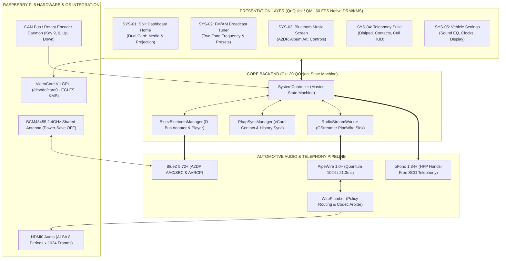

# Apex HORIZON IVI - Raspberry Pi 5 Automotive Digital Head Unit

<div align="center">


### Production-Grade Automotive In-Vehicle Infotainment (IVI) for Raspberry Pi 5
#### Powered by Qt 6.7 LTS, Broadcom VideoCore VII (DRM/KMS EGLFS), and PipeWire Audio

[](CMakeLists.txt)
[-C51A4A.svg?style=for-the-badge&logo=raspberrypi&logoColor=white)](https://www.raspberrypi.com/products/raspberry-pi-5/)
[](https://www.qt.io/)
[](https://pipewire.org/)
[](https://www.bluez.org/)
[](https://dri.freedesktop.org/)
[](.github/workflows/build-validation.yml)

<br/>

<sub>Engineered by <b>Sk Rehan Ahamed</b> | Automotive Digital Cockpit Systems</sub>

</div>

---

## Overview

**Apex HORIZON IVI** is a production-grade automotive digital head unit designed for the **Raspberry Pi 5 (BCM2712 Quad-Core Cortex-A76 @ 2.4 GHz)** running embedded Yocto Linux. It renders authentic **8-inch Display Audio (D-Audio)** cockpit HMIs directly on the VideoCore VII GPU using direct Linux Kernel Mode Setting (KMS) and Direct Rendering Manager (DRM) at a deterministic **60 frames per second** with zero intermediate X11/Wayland display server latency.

This repository is the complete, self-contained Raspberry Pi 5 platform implementation, providing the full Qt 6 / QML user interface, modern C++20 hardware abstraction controllers, PipeWire audio routing pipelines, telephony and contact synchronization, and 1-click deployment automation.

---

## System Architecture



---

## Core Automotive Subsystems

### 1. Bluetooth Audio & Modern Media Card
* **PipeWire Wireless Audio**: High-fidelity AAC/SBC A2DP sink streamed directly to the vehicle's HDMI speakers with zero stuttering.
* **Microsecond D-Bus Control**: Asynchronous `org.bluez.MediaPlayer1` calls for immediate Play/Pause, Next, Previous, Shuffle, and Repeat.
* **Live Album Art & Metadata**: Fetches high-resolution album covers in the background and displays live track progress.
* **Centered Home Screen Widget**: Matches the FM station aesthetic with bold centered typography (`44px` track title, `25px` artist name) and an illuminated backdrop.

### 2. Broadcast Radio Subsystem (FM/AM)
* **PipeWire Sink Integration**: Background audio pipeline (`bin.( audioconvert ! audioresample ! pipewiresink )`) eliminates ALSA hardware lockouts.
* **Dynamic Station Catalog**: Fetches station catalogs from local `/etc/apex-ivi/radio_stations.json` or HTTP streaming server (`http://127.0.0.1:8088/radio/stations.json`).
* **Instant Handover**: Tapping the FM/AM icon from Home or Bottom Dock always opens the FM/AM screen, pausing Bluetooth music to start the radio stream.

### 3. Telephony Suite & Live Call HUD
* **Deterministic Audio Priority Hierarchy ("One at a Time")**:
  1. **Priority 1 (Absolute Highest)**: **Phone Calls (HFP)** — auto-silences and blocks all media.
  2. **Priority 2**: **Bluetooth Music (A2DP)** — starting music immediately halts FM/AM radio.
  3. **Priority 3**: **FM/AM Radio** — starting radio immediately pauses Bluetooth music.
* **PBAP 1.1 / Legacy Phonebook Sync**: Asynchronously extracts phone contacts and caches the newest 25 call history records (Incoming, Outgoing, Missed).
* **Real-Time Telemetry**: Live AT+CIND and BlueZ Battery1 polling displaying cellular signal bars (0–5) and phone battery percentage.
* **OEM In-Call Display & Dialpad Drawer**:
  - 140px glowing caller avatar badge with breathing animation during dialing.
  - Pixel-perfect button alignment: `Use Private`, `End`, and the right sidebar's `Keypad` button share the exact same horizontal baseline.
  - Slide-out in-call DTMF dialpad drawer with live digits buffer and backspace.

---

## Repository Structure

```
apex_IVI_midEnd_rasberryPi5/
├── CMakeLists.txt                         # Qt 6 / C++20 build configuration
├── Makefile                               # make build, make clean
├── resources.qrc                          # QML & Asset resource manifest
├── src/                                   # Master C++ controllers & Bluetooth engines
│   ├── main.cpp                           # Entry point & DRM/KMS EGLFS initialization
│   ├── SystemController.hpp / .cpp        # Master system state machine & media arbitration
│   ├── BluezBluetoothManager.hpp / .cpp   # BlueZ 5 D-Bus player, pairing & battery manager
│   ├── PbapSyncManager.hpp / .cpp         # PBAP vCard parser & call history synchronizer
│   └── NativeAudioRecorder.h / .mm        # Audio capture engine
├── qml/                                   # Complete QML presentation layer
│   ├── Main.qml                           # Viewport, router, keybindings & volume HUD
│   └── components/
│       ├── navigation/                    # TopStatusBar, BottomDock
│       └── screens/                       # 21 automotive subsystem screens
├── assets/                                # OEM icons, wallpapers, fonts & audio chimes
├── rpi5/                                  # Raspberry Pi 5 embedded runtime bundle
│   ├── pipewire/
│   │   ├── 10-audio-stability.conf        # Quantum 1024 frame lock (21.3ms)
│   │   ├── 20-ivi-hdmi.conf               # 8 periods x 1024 frames ALSA HDMI buffer
│   │   └── 10-bluez-ofono.conf            # WirePlumber A2DP & oFono HFP routing
│   ├── udev/
│   │   └── 70-wifi-powersave.rules        # Wi-Fi power save disable for 2.4GHz RF coexistence
│   ├── systemd/
│   │   ├── apex-ivi.service               # DRM/KMS EGLFS auto-boot systemd service
│   │   ├── apex-button-emulator.service   # Background rotary knob keybinding service
│   │   ├── apex-radio-server.service      # HTTP live radio station catalog server
│   │   └── 30-pipewire-audio.conf         # PipeWire audio environment drop-in
│   ├── display/
│   │   ├── kms.json                       # Atomic DRM/KMS scanout plane configuration
│   │   └── asound.conf                    # ALSA hardware bridge
│   └── scripts/
│       ├── apex-fetch-artwork.py          # Live album art fetcher
│       ├── apex-radio-server.py           # Local radio streaming server
│       ├── radio_stations.json            # Curated Indian FM/AM station catalog
│       └── fast-deploy.sh                 # 1-click cross-compilation & SSH deployment
└── .github/
    └── workflows/
        ├── build-validation.yml           # Automated CI build validation on push/PR
        └── release-rpi5.yml               # Automated release packaging on version tags
```

---

## Quick Start & Deployment Guide

### Prerequisites
- Raspberry Pi 5 running custom Yocto Linux or a compatible ARM64 image.
- Target IP address (e.g., `192.168.1.217` or `raspberrypi5.local`).
- Key-based SSH access configured (`ssh root@<IP>`).

### 1-Click Fast Deployment to Pi 5
From your host machine, run:
```bash
./rpi5/scripts/fast-deploy.sh 192.168.1.217
```
This script automatically:
1. Cross-compiles the Qt 6 binary using the Docker build container.
2. Strips debugging symbols to reduce binary size to ~15 MB.
3. Transfers `ApexIVI` directly to `/usr/bin/ApexIVI` on the Pi via SCP.
4. Pushes PipeWire and WirePlumber audio stability configs to `/etc/pipewire/` and `/etc/wireplumber/`.
5. Restarts `pipewire`, `wireplumber`, and `apex-ivi` services seamlessly.

---

## Physical Hardware Emulation (Keybindings)

The IVI supports external CAN bus button integration or keyboard testing:

| Key | Physical Automotive Control | Behavior |
| :---: | :--- | :--- |
| <kbd>↑</kbd> | Rotary Volume Encoder (Right Turn) | Increments master volume (0–45) and reveals floating bottom volume bar |
| <kbd>↓</kbd> | Rotary Volume Encoder (Left Turn) | Decrements master volume (0–45) and reveals floating bottom volume bar |
| <kbd>R</kbd> | Transmission Shifter (Reverse Gear) | Activates 16:9 rear camera with dynamic parking trajectories |
| <kbd>9</kbd> | Head Unit Play / Pause Pushbutton | Toggles active media playback (Radio / USB / Bluetooth audio) |
| <kbd>0</kbd> | Head Unit Power Pushbutton | Stops active media playback (inside player) or powers off media system |

---

## License & Attribution

- **Lead Developer**: **Sk Rehan Ahamed** ([@skrehanahamed](https://github.com/skrehanahamed))
- **Target Platform**: Raspberry Pi 5 (Broadcom BCM2712 / VideoCore VII)
- **License**: MIT License - see the [LICENSE](LICENSE) file for details.
