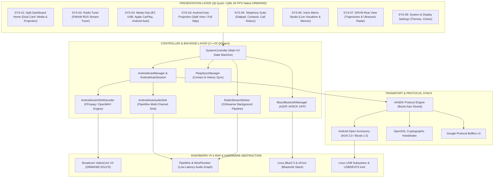

# Apex HORIZON IVI - Raspberry Pi 5 Automotive Digital Head Unit

<div align="center">


### Production-Grade Automotive In-Vehicle Infotainment (IVI) for Raspberry Pi 5
#### Powered by Qt 6.7 LTS, Broadcom VideoCore VII (DRM/KMS EGLFS), and PipeWire Audio

[](CMakeLists.txt)
[-C51A4A.svg?style=for-the-badge&logo=raspberrypi&logoColor=white)](https://www.raspberrypi.com/products/raspberry-pi-5/)
[](https://www.qt.io/)
[](https://pipewire.org/)
[](https://www.bluez.org/)
[](https://dri.freedesktop.org/)
[](.github/workflows/build-validation.yml)

<br/>

<sub>Engineered by <b>Sk Rehan Ahamed</b> | Automotive Digital Cockpit Systems</sub>

</div>

---

## Overview

Apex HORIZON IVI is a production-grade automotive digital head unit designed for the Raspberry Pi 5 (Broadcom BCM2712 Quad-Core Cortex-A76 at 2.4 GHz) running embedded Yocto Linux. It renders an authentic 8-inch Display Audio (D-Audio) cockpit interface directly on the VideoCore VII GPU using direct Linux Kernel Mode Setting (KMS) and Direct Rendering Manager (DRM) at a deterministic 60 frames per second with zero intermediate X11 or Wayland window manager overhead.

This repository provides the complete, self-contained Raspberry Pi 5 platform implementation, containing the Qt 6 / QML user interface, C++20 hardware abstraction controllers, native Android Auto projection via AASDK, PipeWire audio routing pipelines, Bluetooth telephony with PBAP contact synchronization, and automated USB reset and deployment tools.

---

## What's New: September 14, 2026 (v1.2.0)

Date of Update: September 14, 2026  
Release Version: v1.2.0

### Key Deliverables Added Today:

1. Native Android Auto Projection via AASDK Engine
   - Built a direct C++ protocol bridge implementing Android Open Accessory (AOA) 2.0.
   - Embedded SSL/TLS cryptographic handshake verifying mobile phone sessions over USB.
   - Real-time H.264 video decoding pipeline streaming 1280x720 60 FPS to a custom QQuickItem (`AndroidAutoVideoItem`).
   - Integrated touch input translation and physical keycode dispatch (`KEYCODE_MEDIA_PLAY`, `KEYCODE_MEDIA_PAUSE`).

2. Dual-Projection Cockpit Modes
   - Android Auto Split-Screen: Default multi-view dashboard displaying side-by-side active navigation, music player widget, and navigation rail.
   - Full Map View: Dedicated one-tap projection mode that directly expands Google Maps to full-screen navigation.
   - Drawer Return: Native integration with Android Auto app drawer home button (`onShutdownRequest`) to cleanly restore the OEM IVI home screen.
   - Splash screens eliminated for instantaneous transitions.

3. Low-Latency PipeWire Audio Priority Arbitration
   - Channel 4 Media Audio Monitoring: Detects active audio streams from phone apps (Spotify, YouTube Music) and claims audio focus immediately.
   - Sub-Millisecond FM Radio Cutoff: Replaced slow SIGTERM buffer flushing with direct `SIGKILL` and process cleanup (`killall -9 gst-play-1.0`), stopping FM radio in less than 1 ms.
   - Reverse Media Pausing: Switching to FM radio or USB media immediately dispatches `KEYCODE_MEDIA_PAUSE (127)` over Android Auto Input Channel 7.

4. USB Hotplug and Reconnect Engine (`apex-usb-reset.py`)
   - Implemented `apex-usb-reset.py` using Linux `USBDEVFS_RESET` ioctl calls to reinitialize AOA accessory devices on deployment or service restart.
   - Eliminates the need to physically unplug and re-plug USB cables between system resets.

---

## End-to-End System Architecture



---

## Hardware and Display Specifications

- Host Single-Board Computer: Raspberry Pi 5 Model B (BCM2712 Quad-Core Cortex-A76 @ 2.4 GHz)
- Graphics Processor: Broadcom VideoCore VII GPU with native DRM/KMS EGLFS platform plugin
- Native Display Resolution: 1280x720 @ 60 Hz (standard automotive D-Audio aspect ratio)
- Audio Output: HDMI multi-channel PCM and 3.5mm / I2S audio sink managed by PipeWire
- Operating System: Custom Embedded Yocto Linux (Poky Scarthgap, systemd init)

---

## Platform Directory Layout

```
apex_IVI_midEnd_rasberryPi5/
├── CMakeLists.txt                # CMake build configuration for Qt 6 and AASDK
├── README.md                     # Platform and architecture documentation
├── THIRD_PARTY_LICENSES.md       # Open-source license attribution
├── resources.qrc                 # Qt binary resource collection
├── assets/                       # UI iconography, fonts, and branding
├── qml/                          # Qt Quick 6 presentation layer
├── src/                          # C++20 backend engines
├── rpi5/                         # Raspberry Pi 5 platform configurations
│   ├── display/                  # KMS configuration and resolution setup
│   │   └── kms.json              # Direct DRM/KMS connector mapping
│   ├── pipewire/                 # PipeWire and WirePlumber configuration
│   │   ├── 10-audio-stability.conf # Quantum and buffering rules
│   │   ├── 10-bluez-ofono.conf   # Bluetooth and telephony routing
│   │   └── 20-ivi-hdmi.conf      # Dedicated HDMI sink configuration
│   ├── scripts/                  # Target runtime and deployment scripts
│   │   ├── apex-button-emulator.py # GPIO steering wheel button emulator
│   │   ├── apex-fetch-artwork.py # Online radio metadata and artwork fetcher
│   │   ├── apex-radio-server.py  # Local radio catalog HTTP service
│   │   ├── apex-usb-reset.py     # USB AOA endpoint reset utility
│   │   ├── deploy-audio.sh       # PipeWire deployment script
│   │   ├── deploy-telephony.sh   # oFono telephony configuration script
│   │   ├── fast-deploy.sh        # Containerized build and live deploy script
│   │   └── radio_stations.json   # Live radio station catalog
│   ├── systemd/                  # Linux system services
│   │   ├── 30-pipewire-audio.conf # Audio environment drop-in
│   │   ├── apex-button-emulator.service
│   │   ├── apex-ivi.service      # Main IVI application systemd service
│   │   └── vnc-audio-server.service
│   └── udev/                     # Automotive udev rules
│       └── 99-carplay-usb.rules
└── scripts/                      # Release and packaging tools
    └── generate_release_notes.py # Automated release notes generator
```

---

## Target Deployment Instructions

### 1. Build and Flash via Fast-Deploy Script
From the developer workstation:
```bash
bash rpi5/scripts/fast-deploy.sh
```

### 2. Manual Installation on Raspberry Pi 5
```bash
# Push binary to target
scp build/ApexIVI root@192.168.1.217:/tmp/ApexIVI

# Install and restart service
ssh root@192.168.1.217 "
  systemctl stop apex-ivi && \
  mv /tmp/ApexIVI /usr/bin/ApexIVI && \
  chmod +x /usr/bin/ApexIVI && \
  /usr/bin/python3 /usr/bin/apex-usb-reset.py || true && \
  systemctl start apex-ivi
"
```

---

## GitHub Actions Continuous Integration

Workflows located in `.github/workflows/`:

- `build-validation.yml`: Builds and validates the Qt 6 IVI application on Ubuntu 22.04 with GCC and CMake.
- `release-rpi5.yml`: Automated release packaging generating `apex-ivi-rpi5-configs.tar.gz` and source distribution bundles on version tags.

---

## Third-Party Credits and Acknowledgments

We express our sincere appreciation to the open-source projects and developers whose research and libraries enabled this platform:

- f1xpl / aasdk: Foundational C++ implementation of the Android Auto protocol SDK.
- f1xpl / openauto and opencardev / crankshaft: Pioneering open-source automotive head units for Raspberry Pi.
- Steffen K. / aa-proxy-rs: High-performance Rust reverse-engineering reference for Android Auto USB AOA protocol handling.
- PipeWire and WirePlumber: Modern pro-audio and automotive low-latency multimedia routing framework.
- Qt Project: Cross-platform GUI and presentation engine.
- Raspberry Pi Ltd. and The Yocto Project: Hardware platform, VideoCore drivers, and embedded build framework.

---

## License

This project is licensed under the MIT License - see the [LICENSE](LICENSE) file for details.
Third-party licenses and acknowledgments are documented in [THIRD_PARTY_LICENSES.md](THIRD_PARTY_LICENSES.md).
